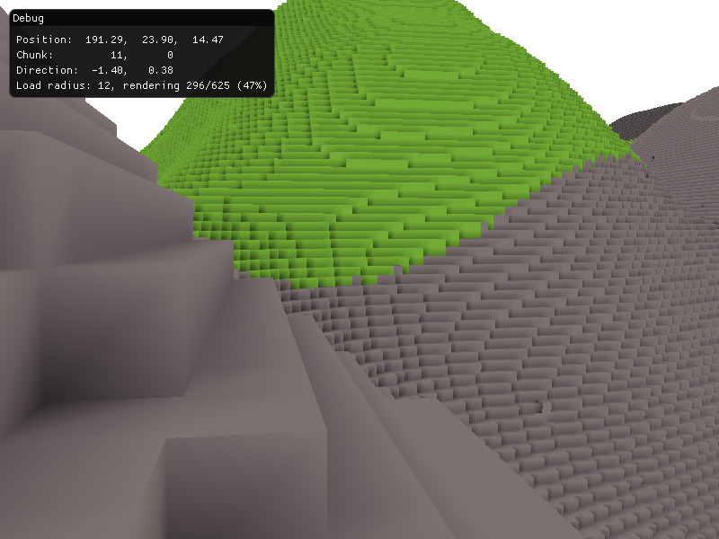
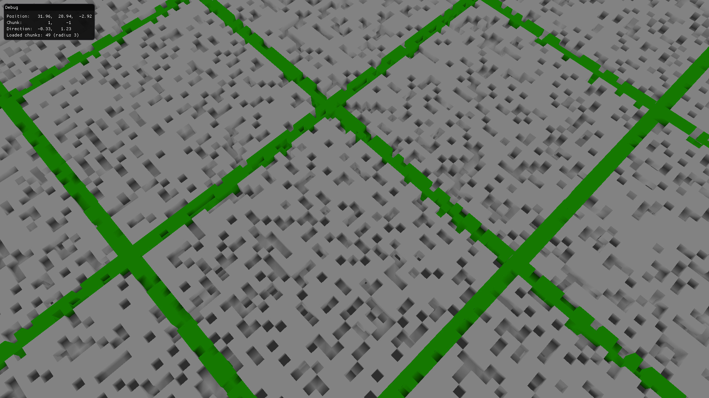
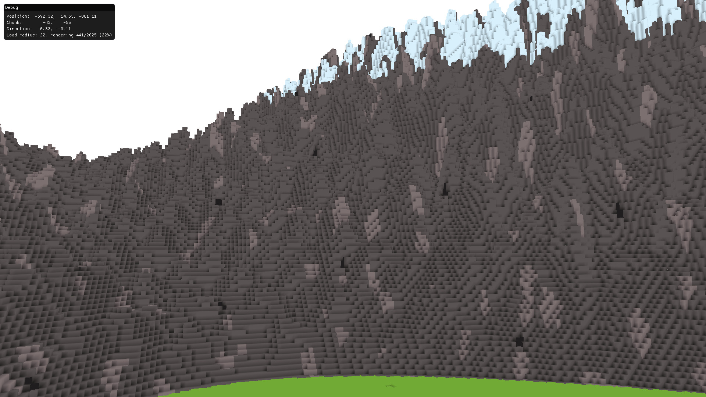

# voxels-plus-plus

A reasonably high-performance, multi-threaded, badly-procedural voxel world renderer. Chunks are generated and rendered around the player as they move around (WASD). Arrow up and down to change the chunk load radius.

    

---

Complex ambient occlusion:

    

The explanation for "badly-procedural":

    

